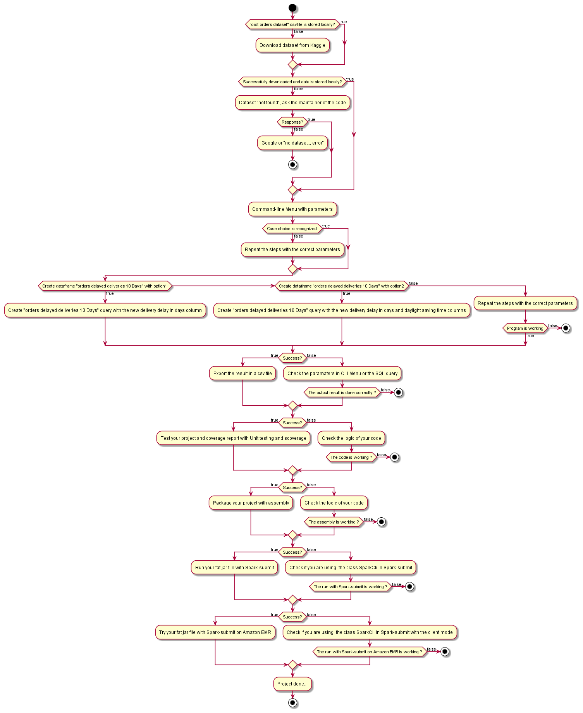

# Data pipelines 2 project

[](https://doi.org/10.5281/zenodo.5812987)

[](https://github.com/dwyl/esta/issues)

[](http://hits.dwyl.com/{username}/{project-name})

> **Author:**
> [Badr Tajini](https://scholar.google.fr/citations?user=YuxT3tYAAAAJ&hl=en) <br>

## Abstract 
In this github repository, we tackle two projects with different issues:

- **First project**

`OliDiscovery application`
the purpose of the project is to 
Identify all late deliveries beyond 10 days

- **Second project**

`Encrypt` and `Decrypt` a password with modern `AES encryption/decryption` in `Scala` using `Cypher` (cryptography) and `encoding` `decoding` with `Base64` while handling `bad encoding`.

> Important : More details are provided in each project's Readme.


## Table of Content

- [Data pipelines 2 project](#data-pipelines-2-project)
  * [Abstract](#abstract)
  * [Table of Content](#table-of-content)
  * [Project structure](#project-structure)
  * [Requirements](#requirements)
  * [Preparing the Environment](#preparing-the-environment)
  * [Install software with choco](#install-software-with-choco)
  * [Installation of our project](#installation-of-our-project)
  * [Architecture](#architecture)
  * [Citation](#citation)

<small><i><a href='http://ecotrust-canada.github.io/markdown-toc/'>Table of contents generated with markdown-toc</a></i></small>


## Project structure
```
Path_to_your_root\DATA_PIPELINES2_PROJECT
├───bad_encoding
└───oli_discovery_app
    ├───data
    ├───project
    └───src
        ├───main
        │   └───scala
        └───test
            └───scala
```
[Back to top](#)
## Requirements

- `VS Code 64 bit`
- `chocolatey version 0.11.3`
- `sbt version 1.6.0`
- `Scala version 2.11.4`
- `Java version 1.8.0_311`
- `git version 2.32.0.windows.2`

[Back to top](#)

## Preparing the Environment
Please install VS Code by following the link below:

[Download](https://code.visualstudio.com/download)

After installing `VS Code`, Install chocolatey if you are using `Windows OS` by following these steps:

- Click `Start` and type `powershell`
- Right-click `Windows Powershell` and choose `Run as Administrator`
- Paste the following command into `Powershell` and press enter.
```
Set-ExecutionPolicy Bypass -Scope Process -Force; `
  iex ((New-Object System.Net.WebClient).DownloadString('https://chocolatey.org/install.ps1'))
```
- Answer `Yes` when prompted
- Close and reopen an elevated `PowerShell` window (as administrator) to start using `choco`.

[Back to top](#)

## Install software with choco

`choco install [packagename]`

In our case, we will install sbt, scala and git.
- `choco install sbt`
- `choco install scala`
- `choco install git`

[Back to top](#)

## Installation of our project
Select the chosen directory or create a new folder and move into it then execute the command below to clone the repository:

`git clone https://github.com/btajini/data-engineering-pipelines-2-project.git`

Move into the cloned directory by using:

`cd data-engineering-pipelines-2-project`

Choose the project you want to run by processing this command:

`cd oli_discovery_app` or `cd bad_encoding`

>Please read carefully the Readme of each project to run the commands properly.
>- Readme of Oli Discovery application project :
>
>   [Readme](oli_discovery_app/README.md)
>
>- Readme of Bad encoding project : 
>
>   [Readme](bad_encoding/README.md)

[Back to top](#)

## Architecture

Architecture of our OliDiscovery application generated thanks to PlantUML as you can see below.
- Puml file : [oli_discovery_processing](assets/oli_discovery_processing.puml)

<p align="center">
     <br />
    <em>
    Figure 1: OliDiscovery application architecture.
    </em>
</p>

[Back to top](#)

## Citation
If you find this repository useful in your work or research, please cite:
```
@software{badr_tajini_2022_5812987,
  author       = {Badr Tajini},
  title        = {data-engineering-pipelines-2-project},
  month        = jan,
  year         = 2022,
  publisher    = {Zenodo},
  version      = {1.1},
  doi          = {10.5281/zenodo.5812987},
  url          = {https://doi.org/10.5281/zenodo.5812987}
}
```
