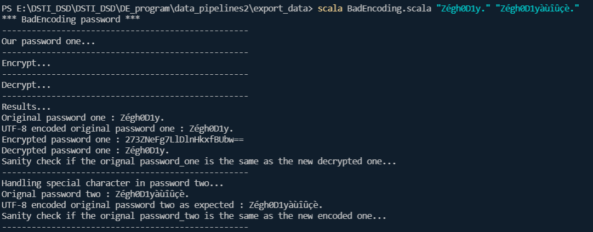
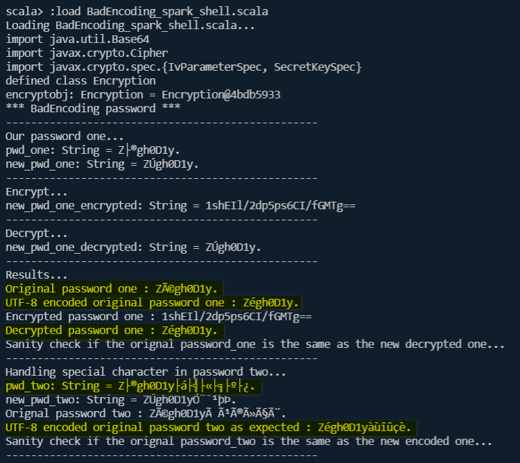

# Bad encoding project

> **Authors:**
> [Badr Tajini](https://scholar.google.fr/citations?user=YuxT3tYAAAAJ&hl=en) <br>

## Abstract 
Pure and modern `AES encryption/decryption` in `Scala` using `Cypher` (`cryptography`) and `encoding decoding with Base64` while handling `bad encoding`.

**Advanced Encryption Standard (AES)** is a symmetric encryption algorithm.
Symmetric encryption is very fast as compared to asymmetric encryption and are used in systems such as database system.

In our case we will try to encrypt and decrypt a password which will be `base64` encoded. By default `AES` assumes the entered text be in `Base64`. The input can be `Base64` encoded or `Hex`. 
And the final decrypted output will be `Base64` **string**.

Second use case is processed where sometimes, we handle password
with special character such as `"é"` or `"à"` (often used in **french language**). The purpose is to keep those password in `UTF-8` format.

## Usage

To try out our algorithm, we assume, you are still in `oli_discovery_app` folder.

- Run those commands below:

`cd .. && cd bad_encoding`

#### From `VS Code` terminal :
- Run:

`scala BadEncoding.scala "Zégh0D1y." "Zégh0D1yàùîûçè."`

>`"Zégh0D1y."` is **password one** and `"Zégh0D1yàùîûçè."` is **password two**.

- Result

<p align="center">
     <br />
    <em>
    Figure 1: Encrypt and Decrypt password with AES algorithm and handling bad encoding in Scala.
    </em>
</p>

[Back to top](#)

#### From `Spark-shell` in VS Code terminal :
- Run:

`spark-shell`

- Then:

`:load BadEncoding_spark_shell.scala`

The behavior in `Spark-shell` with special character is not the same
as you can see below.

<p align="center">
     <br />
    <em>
    Figure 2: Encrypt and Decrypt password with AES algorithm and handling bad encoding in Spark-shell.
    </em>
</p>

The sanity check pass but we also expect a correct output.

- The first password should be:
```
Decrypted password one : Zégh0D1y.  <= is the expected output
```

- The second password should be : 
```
UTF-8 encoded original password two as expected : Zégh0D1yàùîûçè.  <= is the expected output
```

[Back to top](#)