# OliDiscovery application project

> **Authors:**
> [Badr Tajini](https://scholar.google.fr/citations?user=YuxT3tYAAAAJ&hl=en) <br>

## Abstract 

The purpose is to identify all `late deliveries` that exceed `10 days` to be able to grant, for instance, a `10%` discount on the next deliveries to increase sales.

## Purpose

Two options are featured in this application:
- The `first one`:

    **Option 1**
    - Compute the `delay of deliveries`.
    - No timezone is taken account.

- The `second one`:

    **Option 2**
    - Convert all `timestamps` from `UTC-3` to `UTC`.
    - Use `UTC` in all our queries.

[Back to top](#)

## Expected Result
- A csv file with the `customer IDs` and the `number of late deliveries in days`. (option 1)
    - csv file : [export_option1](output/option1_export/part-00000-f7e43534-6c62-4589-8a07-2c73df6140ec-c000.csv)
- A csv file with the `customer IDs`, `the number of late deliveries in days` and `daylight_saving_time` (option 2)
    - csv file : [export_option2](output/option2_export/part-00000-9b98fd20-247c-481c-9b4f-7a0dc7d7acaa-c000.csv)
- `STDOUT` of our spark-submit from `AWS EMR`.
    - txt file : [stdout](output/stdout_olidiscovery.txt)
- `STDERR` of our spark-submit from `AWS EMR`.
    - txt file : [stderr](output/stderr_olidiscovery.txt)

[Back to top](#)

## Table of Content
- [OliDiscovery application project](#olidiscovery-application-project)
  * [Abstract](#abstract)
  * [Purpose](#purpose)
  * [Expected Result](#expected-result)
  * [Table of Content](#table-of-content)
  * [Explanation](#explanation)
  * [Preparing the Environment](#preparing-the-environment)
  * [Structure of the project](#structure-of-the-project)
  * [Usage](#usage)
      - [The definition of arguments:](#the-definition-of-arguments)
      - [Run the option1 :](#run-the-option1)
      - [Run the option2 :](#run-the-option2)
      - [Run the report option1 :](#run-the-report-option1)
      - [Run the report option2 :](#run-the-report-option2)
      - [Run the option3 [Error]](#run-the-option3)
      - [Run Unit testing :](#run-unit-testing)
      - [Package our project  :](#package-our-project)
      - [Run fat jar with spark-submit](#run-fat-jar-with-spark-submit)
      - [Run Unit testing with coverage](#run-unit-testing-with-coverage)
      - [Run the batch on Amazon](#run-the-batch-on-amazon)

<small><i><a href='http://ecotrust-canada.github.io/markdown-toc/'>Table of contents generated with markdown-toc</a></i></small>


## Explanation
Both `options` follow the same logic of identifying all late deliveries beyond `10 days`.
But for `option 2`, we use the conversion of all timestamps from `UTC-3` to `UTC`.

As we can see, in our `olist_orders_dataset` csv file.
There are `5` major states:
```
State             | State code |  Capital       | Timezone
-----------------------------------------------------------
São Paulo         | SP         | São Paulo      | UTC−3
Rio de Janeiro	  | RJ	       | Rio de Janeiro | UTC−3
Minas Gerais	  | MG         | Belo Horizonte | UTC−3
Rio Grande do Sul | RS         | Porto Alegre   | UTC−3
Paraná	          | PR	       | Curitiba       | UTC−3
```
They all have the same timezone but the dataset captures data between `2016` and `2018`.
Interestingly, Brazil has stopped adopting daylight saving time as from `2019`.

Therefore, we have to be very careful when converting from `UTC-3` to `UTC` when purchases have been made in `winter` and `summer`.

For this reason, we have included a valuable piece of information, `"summer or winter time"` in the final dataframe by running `option 2`. We will see later in the project that the number of delayed deliveries increases thanks to this **technique**.

Daylight saving time in Brazil usually starts in `mid-october` and ends in `February`.
Based on `Olist data`, the recorded years are `2016`, `2017`, `2018`.

- According to the official archives, the summer hours start precisely:

```
year           End Summer time         Start Summer time
2016	Sunday, 21 February, 00:00	Sunday, 16 October, 00:00
2017	Sunday, 19 February, 00:00	Sunday, 15 October, 00:00
2018	Sunday, 18 February, 00:00	Sunday, 4 November, 00:00

Daylight saving time +1 hour => UTC-2
```

To convert timestamp from `UTC-3` to `UTC` taking into account the time differences between seasons, it is simple. On `Spark`, it's handled automatically. 

However, in order to include the `Winter` or `Summer` time information into our datafram, we have created a single query that takes into account the time intervals.

- Example : 
```
|   time_zone        | timestamp_UTC-3   | timestamp_UTC     | daylight_saving_time |
|America/Sao_Paulo   |2017-11-18 19:28:06|2017-11-18 21:28:06| Summer_time          | =>(+1 hour) from UTC-3 to UTC-1
|America/Sao_Paulo   |2018-02-20 19:28:06|2018-02-20 22:28:06| Winter_time          | => from UTC-3 to UTC
```
[Back to top](#)
## Preparing the Environment

To try out our application, we assume, you are still in `data_pipelines2_project` folder.
- On the VS Code terminal:

    `cd oli_discovery_app`

Normally, the ***project folder*** inside `oli_discovery_app` is not created but for the sake of simplicity and readability, the folder is created with four files as below:
```
- assembly.sbt       // is used to package our projet into a fat jar.
- build.properties   // is used to add the version of the sbt as properties.
- Dependencies.scala // is used to add useful dependencies for the application.
- plugins.sbt        // is used to add plugins for test coverage and report.
- build.sbt          // is used to build the sbt of our project.
```
[Back to top](#)
## Structure of the project
```
Path_to_your_root\DATA_PIPELINES2_PROJECT\OLI_DISCOVERY_APP     
├───assets
├───data
├───project
└───src
    ├───main
    │   └───scala
    └───test
        └───scala
```
[Back to top](#)
## Usage

After this brief introduction, let's get to the heart of the matter.

- First in your terminal launch sbt locally:
> Important: all tests are done on VSCode terminal.

`sbt`

- The `sbt` wil be compiled automatically,
inside `sbt`, you will see:

<p align="center">
    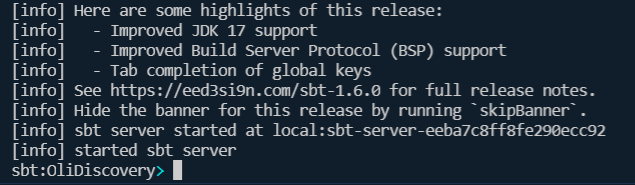 <br />
    <em>
    Figure 1: sbt first run.
    </em>
</p>

[Back to top](#)
#### The definition of arguments:
```
- options : "option1 | option2" if another option is chosen, an error is raised.
- datastore : path to csv file "olist_orders_dataset.csv".
- folder to save the output : "output".
- Condition for testing : "false" for processing the application and storing the output result, "true" for Unit testing only.
```
[Back to top](#)
#### Run the option1 :

`run "option1" "data/olist_orders_dataset.csv" "output" "false"`

The output of `option 1` is a csv file with the `customer IDs` and the `number of late deliveries in days`.
<p align="center">
    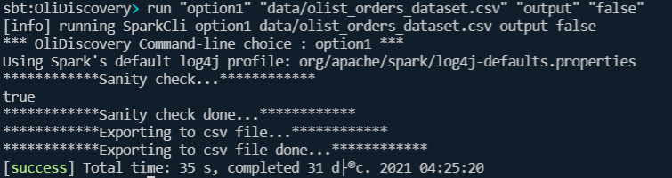 <br />
    <em>
    Figure 2: Processing option1.
    </em>
</p>

- Output of option1:
<p align="center">
    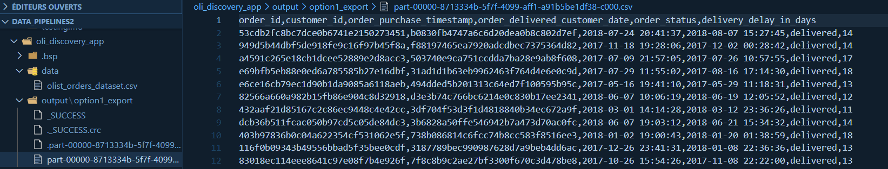 <br />
    <em>
    Figure 3: Output of option1.
    </em>
</p>

[Back to top](#)

#### Run the option2 :

`run "option2" "data/olist_orders_dataset.csv" "output" "false"`

The output of `option 2` is a csv file with the `customer IDs`, `the number of late deliveries in days` and `daylight_saving_time`. You can find more details about `daylight saving time` in the `Explanation` section.
<p align="center">
    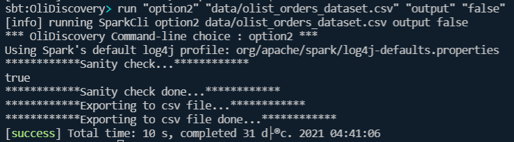 <br />
    <em>
    Figure 4: Processing option2.
    </em>
</p>

- Output of option2:
<p align="center">
    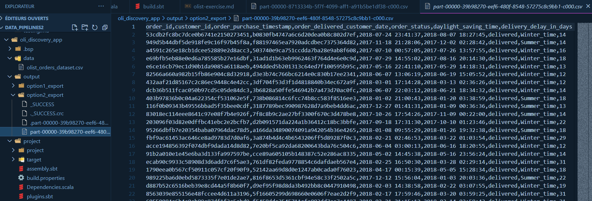 <br />
    <em>
    Figure 5: Output of option2.
    </em>
</p>

[Back to top](#)

#### Run the report option1 :

`run "report_option1" "data/olist_orders_dataset.csv" "false"`

The function `report_option1` reproduces the result of `option1`, at the end we generate the final result on the terminal.
<p align="center">
    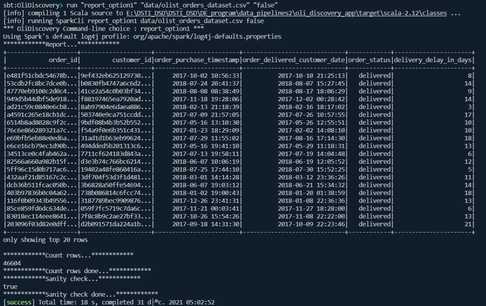 <br />
    <em>
    Figure 6: Processing report option1.
    </em>
</p>

[Back to top](#)

#### Run the report option2 :

`run "report_option2" "data/olist_orders_dataset.csv" "false"`

The function `report_option2` reproduces the result of `option2`, at the end we generate the final result on the terminal.
<p align="center">
    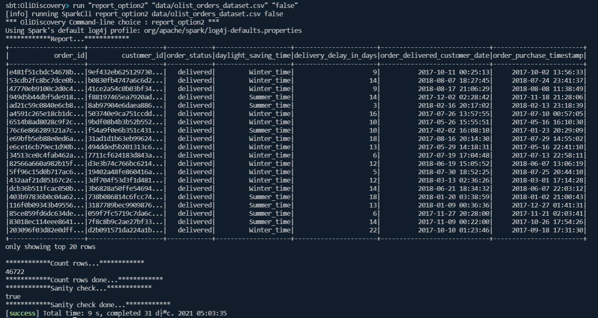 <br />
    <em>
    Figure 7: Processing report option2.
    </em>
</p>

[Back to top](#)

#### Run the option3 :

`run "option3" "data/olist_orders_dataset.csv" "false"`

We get error, the option does not exist.

<p align="center">
    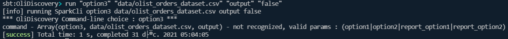 <br />
    <em>
    Figure 8: Processing option3, an error is raised.
    </em>
</p>

[Back to top](#)

#### Run Unit testing :

To run tests, we assume you are still in `sbt`.
In your terminal, type :

`test`

A report is generated with all results successfully completed.

<p align="center">
    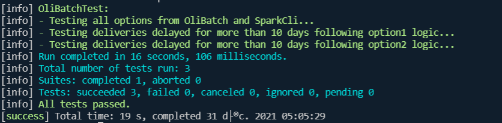 <br />
    <em>
    Figure 8: Processing option3, an error is raised.
    </em>
</p>

[Back to top](#)

#### Package our project  :

To package your project, exit sbt as follow:

```
sbt:OliDiscovery> exit
[info] shutting down sbt server
```

we assume you are in the root of `oli_discovery_app`.

Create `assembly.sbt` file in `project folder`. For the sake of simplicity, the folder is already created or you can follow these steps:
```
mkdir project
cd project
nano assembly.sbt or vim assembly.sbt
```
- Then add:

`addSbtPlugin("com.eed3si9n" % "sbt-assembly" % "1.0.0")`

<p align="center">
    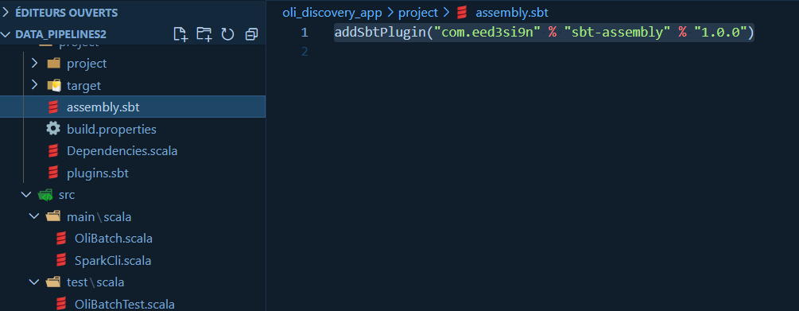 <br />
    <em>
    Figure 9a: Create assembly.sbt file.
    </em>
</p>

Save your `assembly.sbt` file.

- Back to the root of `oli_discovery_app`

`cd ..`

- Launch: 

`sbt`

- Then:
    - `clean` 
    - `reload`
    - `compile`
    - `assembly`

- Result:

<p align="center">
    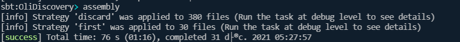 <br />
    <em>
    Figure 9b: Processing assembly.sbt file.
    </em>
</p>


A `fat jar` is created and saved in `target/scala-2.12/OliDiscovery-assembly-1.0.jar`.

[Back to top](#)

#### Run fat jar with spark-submit
We can test our `fat jar` with the commands below:

- Exit first `sbt` by typing `exit`.
```
spark-submit --class SparkCli target/scala-2.12/OliDiscovery-assembly-1.0.jar "option1" "data/olist_orders_dataset.csv" "output" "false"
spark-submit --class SparkCli target/scala-2.12/OliDiscovery-assembly-1.0.jar "report_option1" "data/olist_orders_dataset.csv" "false"
spark-submit --class SparkCli target/scala-2.12/OliDiscovery-assembly-1.0.jar "option2" "data/olist_orders_dataset.csv" "output" "false"
spark-submit --class SparkCli target/scala-2.12/OliDiscovery-assembly-1.0.jar "report_option2" "data/olist_orders_dataset.csv" "false" 
```

- Result:

<p align="center">
    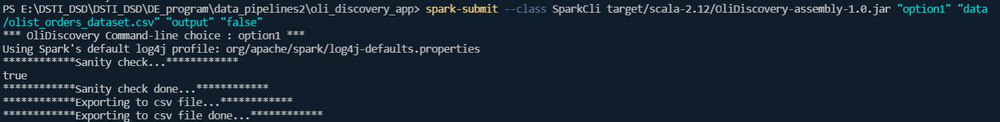 <br />
    <em>
    Figure 9c: Processing spark-submit OliDiscovery-assembly-1.0.jar with option1.
    </em>
</p>

- Result:

<p align="center">
    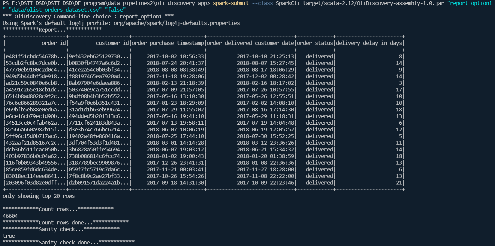 <br />
    <em>
    Figure 9d: Processing spark-submit OliDiscovery-assembly-1.0.jar with report option1.
    </em>
</p>

[Back to top](#)

#### Run Unit testing with coverage

we assume you are in the root of `oli_discovery_app`.

Create `plugins.sbt` file in ***project folder***. For the sake of simplicity, the folder is already created or you can follow these steps:
```
mkdir project
cd project
nano plugins.sbt or vim plugins.sbt
```
- Then add:

`addSbtPlugin("org.scoverage" % "sbt-scoverage" % "1.6.1")`

<p align="center">
    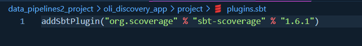 <br />
    <em>
    Figure 10: Create plugins.sbt file.
    </em>
</p>

Save your `plugins.sbt` file.

- Back to the root of `oli_discovery_app`

`cd ..`

- Launch: 

`sbt`

- Then:
    - `clean` 
    - `coverage`
    - `test`
    - `coverageReport`

A report is generated with coverage. From scoverage we can see percentage about 83%.

<p align="center">
    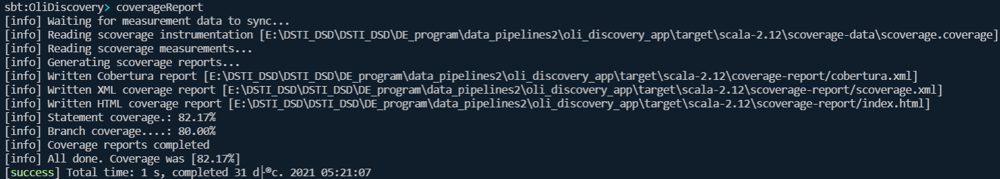 <br />
    <em>
    Figure 11: coverage report.
    </em>
</p>

- Result:

<p align="center">
    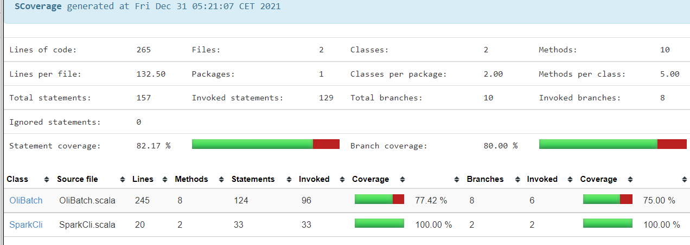 <br />
    <em>
    Figure 12: coverage report in web browser.
    </em>
</p>


Normally it is 100% but with the condition testing = `"false"` in the `option1` and `option2` functions.
we don't want to test this condition since it is only used to export the csv file of each function as shown below:
<p align="center">
    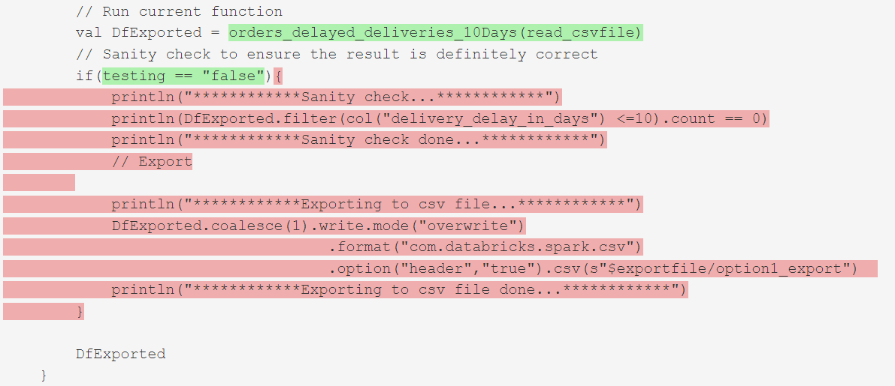 <br />
    <em>
    Figure 13: coverage report in web browser.
    </em>
</p>

[Back to top](#)

#### Run the batch on Amazon

we assume you already have an existing `AWS account`.

You can follow these steps:
```
- Open aws console in your AWS account
- Choose your region [Paris]
- Choose Amazon Elastic MapReduce EMR service
```
- Create a cluster with the following parameters:
<p align="center">
    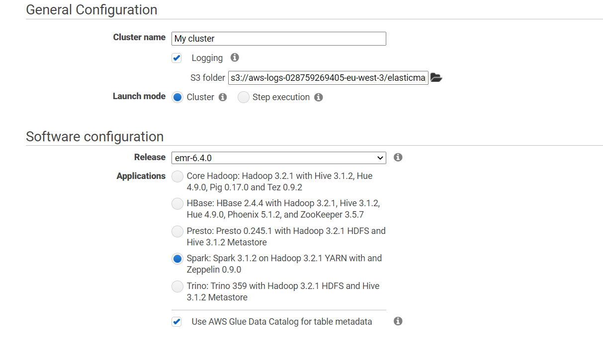 <br />
    <em>
    Figure 14: Create cluster.
    </em>
</p>

- Cluster should be starting

<p align="center">
    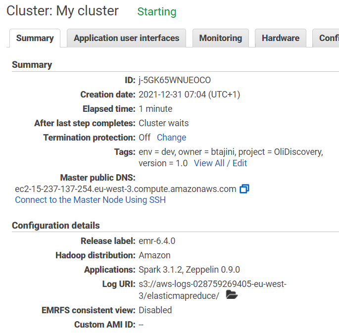 <br />
    <em>
    Figure 15: EMR cluster status.
    </em>
</p>

- Create a S3 bucket - block public access

<p align="center">
    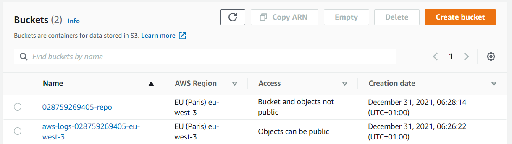 <br />
    <em>
    Figure 16: Create bucket.
    </em>
</p>

- Create jobs and data folder and upload the fat jar in jobs folder and the data (csv file) in data folder.

<p align="center">
    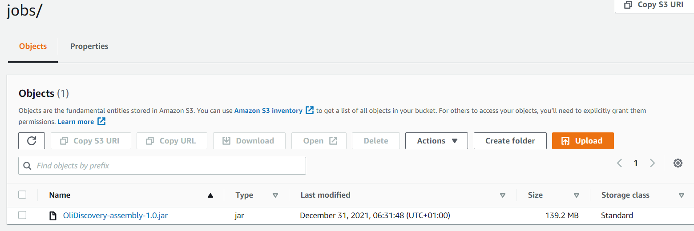 <br />
    <em>
    Figure 17: Jobs folder.
    </em>
</p>

<p align="center">
    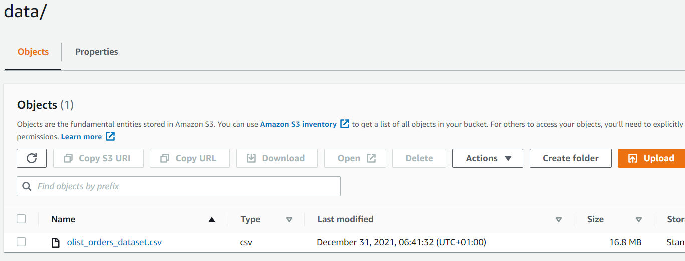 <br />
    <em>
    Figure 17: data folder.
    </em>
</p>

- Check cluster status again.

<p align="center">
     <br />
    <em>
    Figure 17: EMR cluster status.
    </em>
</p>

- Add steps :

<p align="center">
    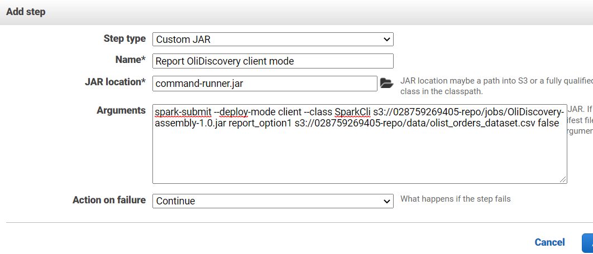 <br />
    <em>
    Figure 18: Add steps spark application client mode.
    </em>
</p>

- Command for steps:
```
spark-submit --deploy-mode client --class SparkCli s3://028759269405-repo/jobs/OliDiscovery-assembly-1.0.jar report_option1 s3://028759269405-repo/data/olist_orders_dataset.csv false

```

- Result : 

<p align="center">
    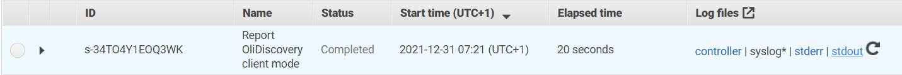 <br />
    <em>
    Figure 18: Spark-submit EMR status is completed.
    </em>
</p>

The running of the steps is completed without error.

Since we are only using `report_option1` to generate results of `option1` without exporting.

Therefore, we have no output parquets to check with `AWS Glue` and `AWS Athena` but from the `stdout` of our `spark-submit`, we can see the generated report of the `option1` as follow:

<p align="center">
    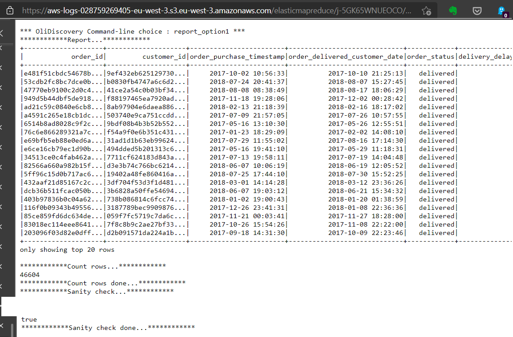 <br />
    <em>
    Figure 18: STDOUT of our spark-submit.
    </em>
</p>

We also check the `stderr` of our `spark-submit`, as seen, there is no error during the processing of our job:
<p align="center">
    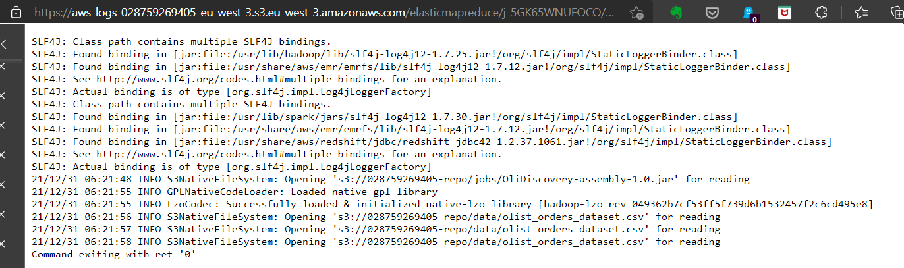 <br />
    <em>
    Figure 18: STDERR of our spark-submit.
    </em>
</p>

[Back to top](#)


